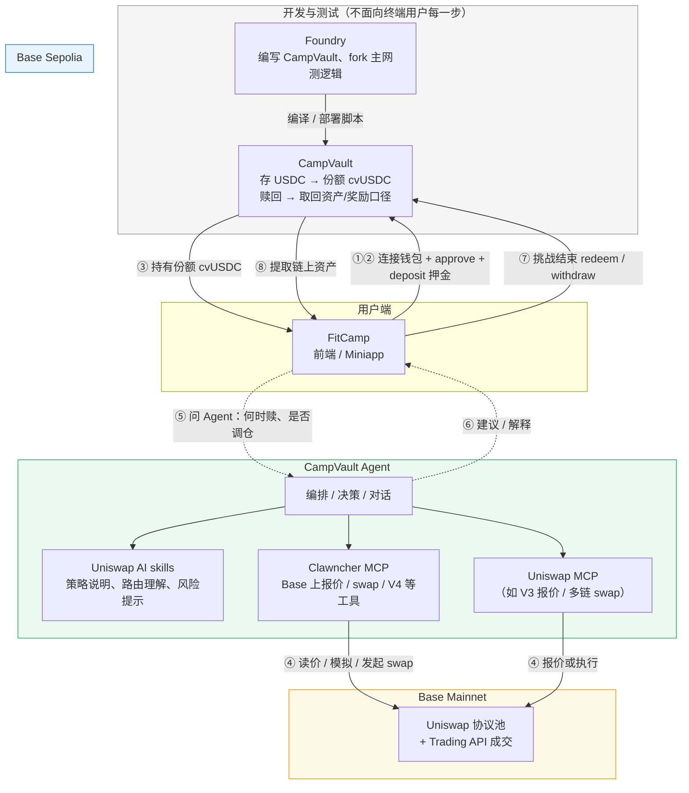

# FitCamp × CampVault：从押金到提取奖励（流程框架）

> 参与方：**FitCamp**、**CampVault**、**CampVault Agent**、**Foundry**、**Base Sepolia**、**Base Mainnet**、**Clawncher MCP**、**Uniswap MCP**、**Uniswap AI skills**

**Foundry** 仅出现在「开发与测试」阶段，不跑在用户每一次链上点击的主路径里。

---

## 两条链分工

| 环节 | Base Sepolia | Base Mainnet |
|------|----------------|--------------|
| 押金 / 份额 / 赎回 | CampVault、FitCamp 主流程 | 一般不强制 |
| 换仓、Uniswap API 成交 | 可选或仅 Agent 建议 | Clawncher / Uniswap MCP 典型落点 |

---

## 流程框架图

---

## 阶段与参与方

| 阶段 | 谁参与 | 做什么 |
|------|--------|--------|
| 构建 | **Foundry** | 开发、测试 CampVault，部署到 **Base Sepolia** |
| ①–③ | **FitCamp** + **CampVault**（Sepolia） | 用户付押金、持有 **cvUSDC** 份额 |
| ④ | **CampVault Agent** + **Clawncher MCP** / **Uniswap MCP** + **Uniswap AI skills** | Agent 用 skills 理解意图，用 MCP 在 **Base Mainnet** 查价/换仓（若产品有「动态池」叙事） |
| ⑤–⑥ | **FitCamp** ↔ **Agent** | 用户咨询；Agent 解读与建议；Vault 本金默认仍在 **Sepolia** |
| ⑦–⑧ | **FitCamp** + **CampVault**（Sepolia） | **赎回份额** → 用户提取链上资产（奖励口径与 Vault 一致时在此完成） |

---

## 工具角色（避免混淆）

| 名称 | 作用 |
|------|------|
| **Uniswap AI skills** | 知识/提示/策略层，帮 Agent **理解** Uniswap 与风险 |
| **Clawncher MCP** | 可调用工具，连 **Base** 与 Uniswap Trading API（见 `docs/MCP_UNISWAP.md`） |
| **Uniswap MCP** | 另一路工具（如 V3 报价）；若只接一个，可与 Clawncher 合并叙述 |

---

## 导出为图片（PNG / SVG）

| 方式 | 步骤 |
|------|------|
| **① Mermaid Live（最快）** | 打开 [mermaid.live](https://mermaid.live) → 把下面 `fitcamp-flow.mmd` 全文粘贴进左侧 → 右上角 **Actions → PNG / SVG** 下载。 |
| **② 命令行** | 在项目根目录执行：`npx -y @mermaid-js/mermaid-cli -i docs/fitcamp-flow.mmd -o docs/fitcamp-flow.png`（首次会下载依赖；也可把 `.png` 改成 `.svg`）。 |
| **③ Cursor 预览** | 装好 Mermaid 预览扩展后，全屏截图预览窗口（适合临时插入 PPT）。 |

独立图源文件（便于复制进 mermaid.live）：**[`fitcamp-flow.mmd`](./fitcamp-flow.mmd)**

---

## 相关文档

- [MCP + Uniswap 配置](./MCP_UNISWAP.md)
- [CampVault 合约](../campvault/README.md)
